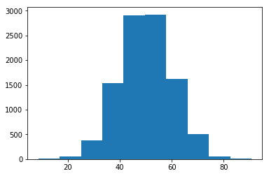

## Installing Python

I highly recommend installing Python using the [Anaconda distribution](https://conda.io/docs/user-guide/install/index.html). It comes with almost all of the packages we will need for this class and pretty much just works. Windows users should especially be grateful as installing Python on Windows used to be an enormous pain...

## IPython vs Python

Ipython is what makes Python interactive. Meaning that you can type some code, get some results, and then type some more code. This is very useful for exploring data because you don't always know what you are looking for and it can be annoying to have to run your entire program every time you make changes.

## Jupyter Notebooks

As you may have noticed, I write all my lectures in jupyter notebooks. These notebooks wrap Ipython with a web editor that allow one to mix code and markdown in one place. While they are not perfect, they offer a lot of benefits for data scientists. I would recommend doing most of your homework in notebooks. To start a notebook, open your terminal, navigate to the folder and type "jupyter notebook" then hit enter. That will open up the notebook! Then in the top right click "New" and select "Python 3" and you should be good to go. 

There are a lot of things that notebooks can do, but we will not cover them all here. The most basic thing is toggling a cell type by selecting "Cell" from the menu. Then "Cell Type." This allows you to change cells from code to markdown and visa versa.

To learn more use Google or here is a [decent guide.](https://www.datacamp.com/community/tutorials/tutorial-jupyter-notebook##UseJupyter)

## The Terminal

Some of you might not be very familiar with the terminal on your computer. I would say it is worth investing some time to learn basic commands. For Mac / Linux users [here](https://computers.tutsplus.com/tutorials/navigating-the-terminal-a-gentle-introduction--mac-3855) is a pretty gentle introduction. I found [something similar](https://www.bleepingcomputer.com/tutorials/windows-command-prompt-introduction/) for Windows, but I am not a Windows user, so I am not sure how good it is. Please feel free to open a pull request if you have a better resource for Windows.

## Git and GitHub/BitBucket

Git is an amazing tool for software development. It allows for pretty easy version control and collaboration.

First, install Git by following [this guide](https://www.atlassian.com/git/tutorials/install-git).

Then, [learn](https://www.atlassian.com/git/tutorials/what-is-version-control) why it is useful.

Lastly, figure out [how to use it](https://www.atlassian.com/git/tutorials/setting-up-a-repository).

## Native Python for Science

Let's see what Python looks like! First, you will notice that Python makes use of whitespace and does not use ; like some other languages.


```python
x = 5
y = 10
x+y
```


    15


We will make use of many libraries. Some are pre-installed with Python, even more come with Anaconda, and some we will have to install ourselves. To get a library use an import statement:


```python
from collections import Counter
```


```python
?Counter()
```

This command imports the class "Counter" from the "collections" library. Counter is actually a really useful tool for data scientists. It can count the number of times items appear in collections like lists. Lists are a useful data structure to store data. For example:


```python
marriage_ages = [22, 22, 25, 25, 30, 24, 26, 24, 35]
value_counts = Counter(marriage_ages)
value_counts.most_common()
```


    [(22, 2), (24, 2), (25, 2), (35, 1), (26, 1), (30, 1)]


**Functions** are also very useful.


```python
def add_two_numbers(x, y):
    """
    Takes in two numbers and returns the sum
    parameters
        x : str
            first number
        y : str
            second number
    returns
        x+y
    """
    z = x + y
    return z
print(add_two_numbers(100,5))
```

    105
    

Today we discovered 100 + 5 = 105

Functions can also be anonymous.


```python
def y(x, y):
    return x+y

y = lambda x, y: x + y
print(y(5,5))
```

    10
    

**Lists** are an extremely useful data structure in Python. When slicing the first number is included in the return set while the last number is not.


```python
depths = [1, 5, 3, 6, 4, 7, 10, 12]
first_5_depths = depths[:5]

print(first_5_depths)
print(sum(depths))
print(max(depths))
print(depths[-1])
print(depths[-2:])
print(depths[2:5])
print(22 in depths)
print(1 in depths)

depths.append(44)
print(depths)
depths.extend([100, 200])
print(depths)

depths[4] = 100
print(depths)

depths.insert(5, 1000)
print(depths)
```

    [1, 5, 3, 6, 4]
    48
    12
    12
    [10, 12]
    [3, 6, 4]
    False
    True
    [1, 5, 3, 6, 4, 7, 10, 12, 44]
    [1, 5, 3, 6, 4, 7, 10, 12, 44, 100, 200]
    [1, 5, 3, 6, 100, 7, 10, 12, 44, 100, 200]
    [1, 5, 3, 6, 100, 1000, 7, 10, 12, 44, 100, 200]
    

**Dictionaries** are key, value pairs.


```python
my_dict = {"age": 22, "birth_year": 1999, "name": "jack", "siblings": ["jill", "jen"]}
print(my_dict['age'])
print('age' in my_dict)
print('company' in my_dict)
print(my_dict.get('age'))
print(my_dict.get('company', 1))
print(my_dict.keys())
print(my_dict.values())
print(my_dict.items())
```

    22
    True
    False
    22
    1
    ['siblings', 'age', 'name', 'birth_year']
    [['jill', 'jen'], 22, 'jack', 1999]
    [('siblings', ['jill', 'jen']), ('age', 22), ('name', 'jack'), ('birth_year', 1999)]
    


```python
x, y = (5, 2)
z = (5,2)
print(x)
print(y)
print(z)
```

    5
    2
    (5, 2)
    

Default dictionaries give you default values when nothing is there.


```python
from collections import defaultdict
```


```python
my_default_dict = defaultdict(int)
my_default_dict['age'] = 22
print(my_default_dict['company'])
```

    0
    

**Sets** are an unordered collection of unique and immutable objects.


```python
my_set = set()
my_set.add(1)
my_set.add(2)
my_set.add(1)
print(my_set)
```

    {1, 2}
    

**If, then statements**


```python
age = 41
def age_check(age):
    if age > 40:
        print("Older than 40")
    elif age > 30 and age <= 40:
        print("Between 30 and 40")
    else:
        print("Other")

age_check(age)
```

    Older than 40
    

**For loops** Start from 0.


```python
names = ['tyler', 'karen', 'jill']
for i, name in enumerate(names):
    print(i)
    print(name)
```

    0
    tyler
    1
    karen
    2
    jill
    


```python
names[0]
```


    'tyler'


**Sorting**


```python
my_list = [2, 10, 1, -5, 22]
my_list.sort()
print(my_list)
```

    [-5, 1, 2, 10, 22]
    


```python
my_list = [2, 10, 1, -5, 22]
my_list_sorted = sorted(my_list, reverse=True)
print(my_list_sorted)
#my_func = lambda x: abs(x)
my_list_sorted_abs = sorted(my_list, key=abs, reverse=True)
print(my_list_sorted_abs)
```

    [22, 10, 2, 1, -5]
    [22, 10, -5, 2, 1]
    

**List Comprehensions**


```python
[s/2 for s in list(range(10))]
```


    [0.0, 0.5, 1.0, 1.5, 2.0, 2.5, 3.0, 3.5, 4.0, 4.5]


```python
numbers_gt_5 = [x for x in range(1,15) if x > 5]
print(numbers_gt_5)
nums_plus_one = [x + 1 for x in range(5)]
print(nums_plus_one)
my_dict = {x: x+1 for x in range(5)}
print(my_dict)
```

    [6, 7, 8, 9, 10, 11, 12, 13, 14]
    [1, 2, 3, 4, 5]
    {0: 1, 1: 2, 2: 3, 3: 4, 4: 5}
    

**Enumerate**


```python
i = 0 
for i, x in enumerate(range(5, 10)):
    print("Index: {0}, Value: {1}".format(i,x))
```

    Index: 0, Value: 5
    Index: 1, Value: 6
    Index: 2, Value: 7
    Index: 3, Value: 8
    Index: 4, Value: 9
    

**Zipping**


```python
list_1 = [1, 2, 3]
list_2 = ['x', 'y', 'z']
for t in zip(list_1, list_2):
    print(t)
print(dict(zip(list_1, list_2)))
```

    (1, 'x')
    (2, 'y')
    (3, 'z')
    {1: 'x', 2: 'y', 3: 'z'}
    


```python
pairs = [('x', 1), ('y', 2), ('z', 3)]
letters, numbers = zip(*pairs)
print(letters)
print(numbers)
```

    ('x', 'y', 'z')
    (1, 2, 3)
    

## The data science stack (not including deep learning)

* [Pandas](http://pandas.pydata.org/) - Provides R like data structures and a high level API to work with data
* [Numpy](http://www.numpy.org/)- Provides fast numerical computing such as arrays and linear algebra
* [Scipy](https://www.scipy.org/) - For scientific computing such as drawing from distributions
* [Matplotlib](https://matplotlib.org/) - For plotting
* [Seaborn](https://seaborn.pydata.org/) - To make your plots look better
* [Scikit-Learn](http://scikit-learn.org/stable/) - For machine learning; great documentation and tutorials
* [Statsmodels](http://www.statsmodels.org/stable/index.html) - For more traditional statistics

**Quick Intro to Numpy**


```python
import numpy as np
```


```python
np_array = np.array([5, 10, 15, 20, 25, 30])
```


```python
print(np.unique(np_array))
print(np.std(np_array))
print(np_array.max())
print(np_array ** 2)
print(np_array + np_array)
print(np.sum(np_array ** 2))
print(np_array.shape)
```

    [ 5 10 15 20 25 30]
    8.5391256383
    30
    [ 25 100 225 400 625 900]
    [10 20 30 40 50 60]
    2275
    (6,)
    

Dot product


```python
np.dot(np_array, np_array)
```


    2275


2d array


```python
np_2d_array = np.array([[1,2,3], 
                        [4,5,6]])
print(np_2d_array)
```

    [[1 2 3]
     [4 5 6]]
    


```python
print(np_2d_array.T)
```

    [[1 4]
     [2 5]
     [3 6]]
    


```python
print(np_2d_array.shape)
```

    (2, 3)
    


```python
print(np_2d_array[1,1])
print(np_2d_array[0,2])
```

    5
    3
    

[Randomness and choosing](https://docs.scipy.org/doc/numpy-1.13.0/reference/routines.random.html)


```python
np.random.rand()
```


    0.6341381996751932


```python
np.random.choice([1,2,3,4,5], 10, replace=True)
```


    array([2, 4, 2, 1, 5, 1, 2, 3, 5, 5])


```python
x = [1,2,3,4,5]
np.random.shuffle(x)
print(x)
```

    [4, 5, 3, 2, 1]
    


```python
np.random.randint(5, 15, 2)
```


    array([10,  7])


**Quick Scipy Stats Intro** More information [here](https://docs.scipy.org/doc/scipy/reference/stats.html)


```python
from scipy import stats
```


```python
stats.pearsonr(np_array, np_array)
```

    Object `stats.pearsonr` not found.
    

Normal Distribution


```python
x = stats.norm.rvs(loc=50, scale=10, size=10000)
```


```python
import matplotlib.pyplot as plt
%matplotlib inline
```


```python
plt.hist(x)
```


    (array([    6.,    59.,   377.,  1535.,  2911.,  2924.,  1619.,   506.,
               55.,     8.]),
     array([  8.65833438,  16.85888643,  25.05943848,  33.25999053,
             41.46054258,  49.66109463,  57.86164668,  66.06219873,
             74.26275078,  82.46330283,  90.66385489]),
     <a list of 10 Patch objects>)





```python
stats.norm.pdf(x=-10, loc=0, scale=1)
```


    7.6945986267064199e-23


```python
stats.norm.cdf(x=0, loc=0, scale=1)
```


    0.5


```python
stats.multivariate_normal.rvs(mean=[0,0], cov=[[1,1],[1,1]], size=5)
```

    /Users/tfolkman/anaconda3/envs/ana2/lib/python2.7/site-packages/scipy/stats/_multivariate.py:528: RuntimeWarning: covariance is not positive-semidefinite.
      out = random_state.multivariate_normal(mean, cov, size)
    


    array([[-0.85786404, -0.85786404],
           [ 0.10677728,  0.10677728],
           [-0.96142851, -0.96142851],
           [ 0.52898963,  0.52898963],
           [ 0.26707587,  0.26707587]])


Bernoulli


```python
np.mean(stats.bernoulli.rvs(p=0.8, size=1000))
```


    0.78300000000000003


Describe


```python
stats.describe(stats.norm.rvs(loc=0, scale=1, size=500))
```


    DescribeResult(nobs=500, minmax=(-2.6872056714823711, 3.006121038895615), mean=0.02950087712076379, variance=0.97951493627758801, skewness=-0.007859622685887961, kurtosis=-0.19483280091937605)


